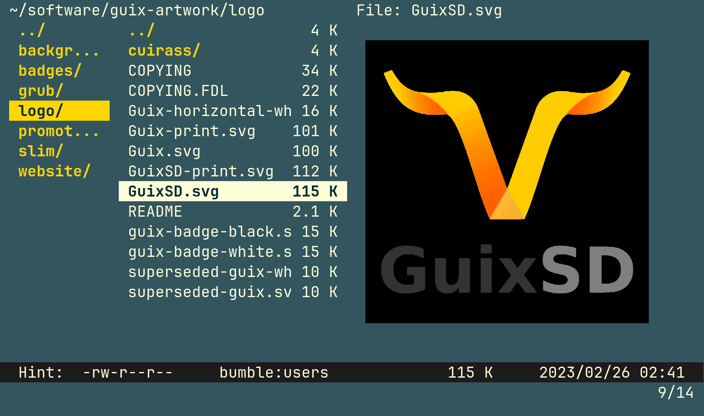

<h3 align="center"></h3>
<p align="center"><code>thu.sh</code> renders preview images to the terminal; ~1000 LOC bash</p>
<p align="center">
<a href="https://github.com/iambumblehead/thu.sh/workflows"></a>
<a href="./LICENSE.md"></a>
<a href="https://github.com/iambumblehead/thu.sh/releases"></a>
</p>

**thu.sh renders images from audio, font, video, pdf, epub, svg** and other files --supporting both kitty and sixel formats. It detects available commands from the system for a small dependency tree,
 * `magick` sixel or `kitten icat` display,
 * `mutool`, `pdftoppm` or `magick` pdf,
 * `ffmpeg` video audio,
 * `magick` font,
 * `unzip` epub,
 * `exiftool` or `identify` file type


```bash
thu.sh /path/to/image.png
thu.sh /path/to/font.ttf
thu.sh /path/to/video.mp4

# display image is placed to fit optional top, left, width and height params
thu.sh /path/to/music.flac $top $left $width $height
thu.sh /path/to/image.svg 0 0 600 600
thu.sh /path/to/book.pdf
thu.sh /path/to/book.epub
```

<dl>
  <dt>Which terminal emulators will render images?</dt>
  <dd>`foot`, `xterm`, `kitty` and `iTerm2` can render images with this script. Sixel support for other terminals is listed here https://www.arewesixelyet.com/</dd>
  <dt>Anything else?</dt>
  <dd>Suggestions and improvements are welcome and appreciated. `thu.sh` may feel "slow" as it presently does not yet cache or reuse preview images it generates.</dd>
</dl>


----------------------------------------------

> [!WARNING]
> vifm image preview no longer working https://github.com/vifm/vifm/issues/731#issuecomment-2025267217

**Add sixel image preview** to [vifm file manager.][10] Instructions [at the wiki.][11]

<div align="left">
 
</div>


[10]: https://github.com/vifm/vifm
[11]: https://github.com/iambumblehead/thu.sh/wiki
